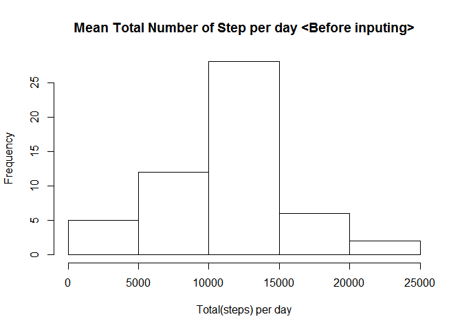
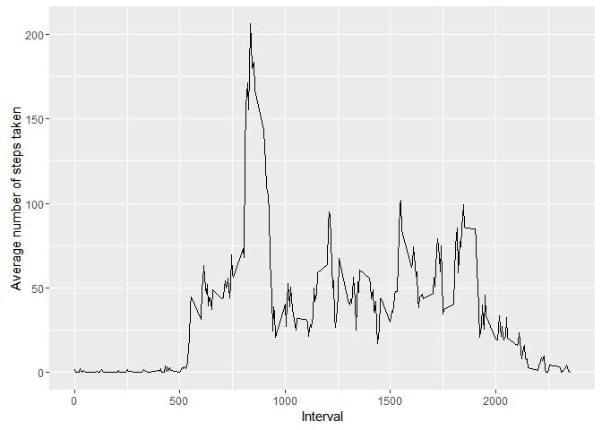
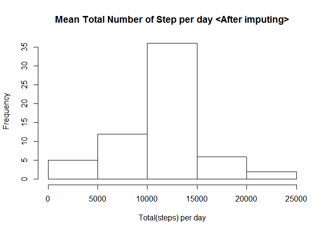
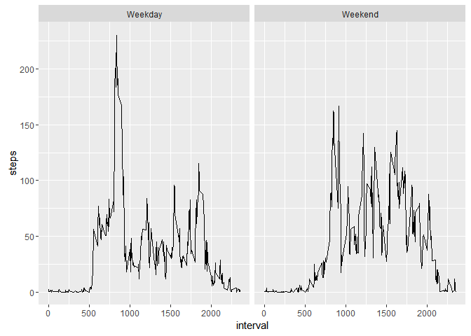

# PA1md.Rmd
SungChan Lee  
2016/2/4  

## Code for reading in the dataset and/or processing the data

```r
library(ggplot2)

# read in data files
setwd("e:\\RExercise\\reproducible research")
activity <- read.csv("activity.csv")
```


## Histogram of the total number of steps taken each day

```r
library(ggplot2)
```

```
## Warning: package 'ggplot2' was built under R version 3.2.3
```

```r
# read in data files
setwd("e:\\RExercise\\reproducible research")
activity <- read.csv("activity.csv")

# histogram without imputing
total_steps_per_day <- aggregate(steps~date, data=activity, FUN=sum, na.rm=TRUE)
View(total_steps_per_day)

hist(total_steps_per_day$steps, xlab="Total(steps) per day", main="Mean Total Number of Step per day <Before inputing>")
```

\

## Mean and median number of steps taken each day

```r
mean_steps_per_day <- setNames(aggregate(steps~date, activity,FUN =mean), c("Date", "Mean.steps.per.day"))
median_steps_per_day <- setNames(aggregate(steps~date, activity, FUN=median), c("Date", "Median.steps.per.day"))

#mean_steps_per_day
#median_steps_per_day
stat_per_day <- merge(mean_steps_per_day,median_steps_per_day)
stat_per_day$Date <- as.Date(stat_per_day$Date, format="%Y-%m-%d")
stat_per_day
```

```
##          Date Mean.steps.per.day Median.steps.per.day
## 1  2012-10-02          0.4375000                    0
## 2  2012-10-03         39.4166667                    0
## 3  2012-10-04         42.0694444                    0
## 4  2012-10-05         46.1597222                    0
## 5  2012-10-06         53.5416667                    0
## 6  2012-10-07         38.2465278                    0
## 7  2012-10-09         44.4826389                    0
## 8  2012-10-10         34.3750000                    0
## 9  2012-10-11         35.7777778                    0
## 10 2012-10-12         60.3541667                    0
## 11 2012-10-13         43.1458333                    0
## 12 2012-10-14         52.4236111                    0
## 13 2012-10-15         35.2048611                    0
## 14 2012-10-16         52.3750000                    0
## 15 2012-10-17         46.7083333                    0
## 16 2012-10-18         34.9166667                    0
## 17 2012-10-19         41.0729167                    0
## 18 2012-10-20         36.0937500                    0
## 19 2012-10-21         30.6284722                    0
## 20 2012-10-22         46.7361111                    0
## 21 2012-10-23         30.9652778                    0
## 22 2012-10-24         29.0104167                    0
## 23 2012-10-25          8.6527778                    0
## 24 2012-10-26         23.5347222                    0
## 25 2012-10-27         35.1354167                    0
## 26 2012-10-28         39.7847222                    0
## 27 2012-10-29         17.4236111                    0
## 28 2012-10-30         34.0937500                    0
## 29 2012-10-31         53.5208333                    0
## 30 2012-11-02         36.8055556                    0
## 31 2012-11-03         36.7048611                    0
## 32 2012-11-05         36.2465278                    0
## 33 2012-11-06         28.9375000                    0
## 34 2012-11-07         44.7326389                    0
## 35 2012-11-08         11.1770833                    0
## 36 2012-11-11         43.7777778                    0
## 37 2012-11-12         37.3784722                    0
## 38 2012-11-13         25.4722222                    0
## 39 2012-11-15          0.1423611                    0
## 40 2012-11-16         18.8923611                    0
## 41 2012-11-17         49.7881944                    0
## 42 2012-11-18         52.4652778                    0
## 43 2012-11-19         30.6979167                    0
## 44 2012-11-20         15.5277778                    0
## 45 2012-11-21         44.3993056                    0
## 46 2012-11-22         70.9270833                    0
## 47 2012-11-23         73.5902778                    0
## 48 2012-11-24         50.2708333                    0
## 49 2012-11-25         41.0902778                    0
## 50 2012-11-26         38.7569444                    0
## 51 2012-11-27         47.3819444                    0
## 52 2012-11-28         35.3576389                    0
## 53 2012-11-29         24.4687500                    0
```

## Time Series plot of the average number of steps taken

```r
ave_steps_per_interval <- aggregate(steps~interval, data=activity, FUN=mean, na.rm=TRUE, na.action=NULL)

qplot(interval, steps, data=ave_steps_per_interval, geom="line", xlab="Interval", ylab="Average number of steps taken")
```

\

## The 5-minute interval that, on average, contains the maximum number of steps

```r
v <- ave_steps_per_interval[ave_steps_per_interval$steps == max(ave_steps_per_interval$steps), ]
v
```

```
##     interval    steps
## 104      835 206.1698
```

## Code to describe and show a strategy for imputing missing data

Strategy consists of following steps   
- calculate mean steps for each interval   
- this mean value will be used for missing values   
- replicate 61 times since there are 60 intervals in the data   
- to vectorize rbind rows into long vectors   
- calculate na vector for step column   
- imput NAs with average of the interval   


```r
# imputing

# calculate mean steps for each interval
# this mean value will be used for missing values
ave_steps_per_interval <- aggregate(steps~interval, data=activity, FUN=mean, na.rm=TRUE, na.action=NULL)

#replicate 61 times since there are 60 intervals in the data
#to vectorize rbind rows into long vectors
long_ave_steps_per_interval <- ave_steps_per_interval
for(i in 1:60) {
  long_ave_steps_per_interval <- rbind(long_ave_steps_per_interval, ave_steps_per_interval)
}

#calculate na vector for step column
na_vectors <- is.na(activity$steps)

#imput NAs with average of the interval
activity[na_vectors, ]$steps <- long_ave_steps_per_interval[na_vectors,]$steps
```

## Histogram of the total number of steps taken each day after missing values are imputed

```r
# show histogram after imputing
total_steps_per_day <- aggregate(steps~date, data=activity, FUN=sum)
View(total_steps_per_day)

hist(total_steps_per_day$steps, xlab="Total(steps) per day", main="Mean Total Number of Step per day <After imputing>")
```

\

## Panel plot comparing the average number of steps taken per 5-minute interval across weekdays and weekends

```r
# calculate average steps for day

library(chron)
```

```
## Warning: package 'chron' was built under R version 3.2.3
```

```r
is_weekend <- is.weekend(activity$date)
activity$weekend <- "Weekday"
activity[is_weekend, ]$weekend <- "Weekend"

ave_steps_per_day <- aggregate(steps~interval+weekend, data=activity, FUN=mean)

qplot(interval, steps, data=ave_steps_per_day, geom="line", facets = .~weekend)
```

\
